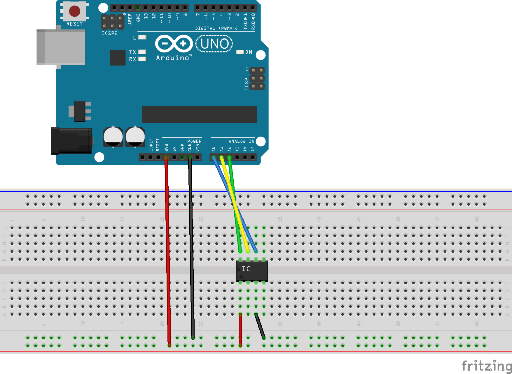
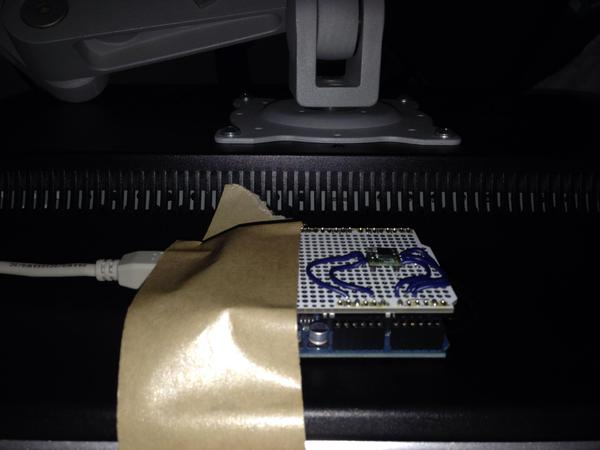

pyRotateDisplay for Mac
======================
Auto-detect the display rotation.

There exists the Windows version, but it is not currently available for some reason.

Demo Video
-----

Requirements
-----
### Hardware ###
+   Arduino
+   [AXDL335](http://www.marutsu.co.jp/pc/i/69272/)

### Software ###
+   [Python3](https://www.python.org/)
+   [PyQt5](http://www.riverbankcomputing.com/software/pyqt/download5)
+   [PyObjC](http://pythonhosted.org/pyobjc/)
+   [pySerial](http://pyserial.sourceforge.net/)

Usage
-----
### Arduino Setup ###

Setup the circit as follows and install the Arduino sketch book.

You can set the specific handshake string into ``static const String hs_str`` before the installation.

After the installation, set Arduino to the back of the display.

### Run ###
	python3 ./pyRotateDisplayMainMac.py

Then, select the port and handshake.

License
----------
Copyright &copy; 2015 pyRotateDisplay
Distributed under the [MIT License][mit].

[Apache]: http://www.apache.org/licenses/LICENSE-2.0
[MIT]: http://www.opensource.org/licenses/mit-license.php
[GPL]: http://www.gnu.org/licenses/gpl.html
